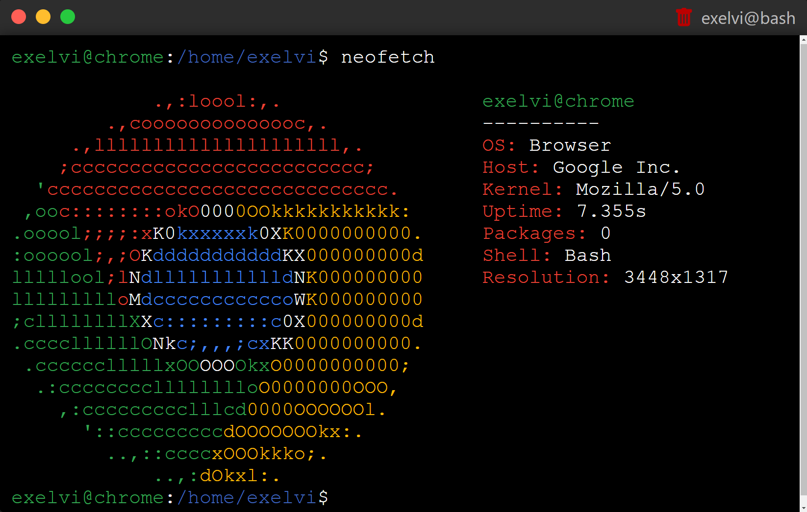

# [terminal](https://exelvi.github.io/terminal)

This is a web-based terminal application built using HTML, CSS, and JavaScript. 
Originally made for portfolio purposes, this project is a simple implementation of a terminal interface that allows users to execute commands, navigate the file system, ecc...

## Features

- Command execution: Users can enter commands and see the output directly in the terminal.
- File system navigation: Users can navigate through directories, list files, and perform basic file operations.
- Command history: Users can access previously executed commands using the up and down arrow keys.
- Resizable terminal, maximizable, and minimizable.

## Usage

### [Open the terminal ](https://exelvi.github.io/terminal)

## Commands

> Note: You can use `sudo` before a command to run it as the root user.

> Note: You can use `> [filename]` at the end of a command to save the output to a file.

| Command | Description | Usage | Notes |
| ------- | ----------- | ----- | ---- |
| `adduser` | Create a new user | `adduser [username]` | |
| `cat` | Display the content of a file | `cat [filename]` | |
| `cd` | Change the current directory | `cd [directory]` | Using `..` will move up one directory, and using `~` will move to the home directory. |
| `clear` | Clear the terminal | `clear` | |
| `color` | Change the color of the terminal | `color (color)` | |
| `cp` | Copy a file or directory | `cp [source] [destination]` | |
| `curl` | Fetch the content from a URL | `curl [url]` | Can't use the curl user-agent since it's a web-based terminal. |
| `date` | Prints the current date and time | `date` | |
| `echo` | Prints text to the terminal | `echo [text]` | |
| `exit` | Close the terminal | `exit` | If root user, will log out. |
| `help` | List all available commands | `help` | |
| `javascript` | Open a javascript console | `javascript (code)` | 
| `ls` | List files in the current directory | `ls` | |
| `mkdir` | Create a new directory | `mkdir [directory]` | |
| `mv` | Move a file or directory | `mv [source] [destination]` | |
| `neofetch` | Print system information | `neofetch` | Ascii art only with Chrome and Safari. |
| `passwd` | Change user password | `passwd (username)` | Leaving out the username will change the current user's password. |
| `pwd` | Print current directory path | `pwd` | |
| `rm` | Delete a file or directory | `rm [file]` | |
| `sh` | Start a shell | `sh [file]` | |
| `su` | Change user | `su (username)` | Leaving out the username will switch to the root user. |
| `touch` | Create a new file | `touch [filename]` | There may be an easteregg :) |
| `userdel` | Delete a user | `userdel [username]` | |
| `usermod` | Modify a user | `usermod [username]` | |
| `whoami` | Print the current user | `whoami` | |
| `wget` | Download a file from a URL | `wget [url]` | |
> [] means required, () means optional

Feel free to explore and experiment with different commands to familiarize yourself with the terminal's capabilities.

## Contributing

Contributions are welcome! If you find any issues or have suggestions for improvements, please open an issue or submit a pull request on the GitHub repository.

